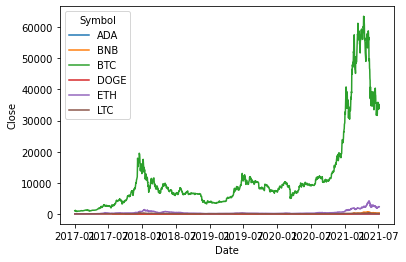
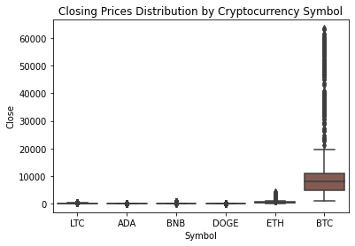
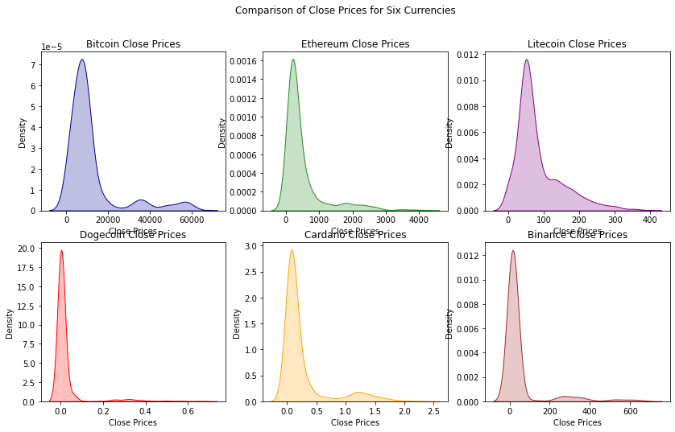
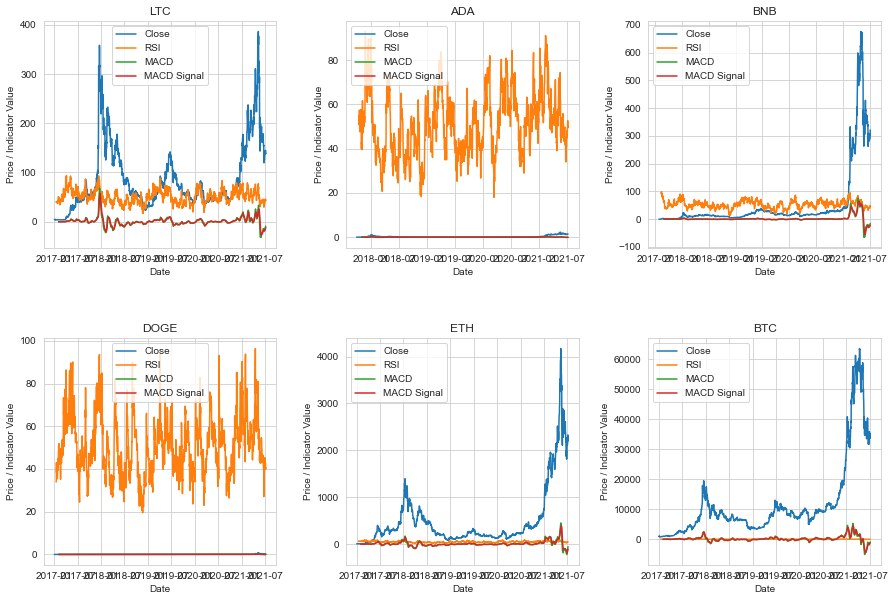

---

<h1 align="center">
  🚀 Predicting Cryptocurrency Prices Using Machine Learning Algorithms 📊
</h1>

<h3 align="center" style="color:#FFA500;">
  Unlock Market Trends | Optimize Investments | Data-Driven Forecasting
</h3>

  
  
  

---

With the advancement and modernization of technology, various industries are rapidly evolving to adapt to the latest global trends. One such change that has been taking place is the increasing prevalence of cryptocurrency as a medium of exchange and investment. This shift towards digital currencies represents a significant departure from traditional fiat currencies and stock exchange practices and It’s the time to understand what digital money really means for everyone’s future.

<h3 align="left">
  🔍 <u>Overview of the Data</u>
</h3>
  

The dataset utilized in this project was sourced from Kaggle Inc, and is publicly accessible under the title "Cryptocurrency Market Data Historical Cryptocurrency Price for All tokens!". 
During this course of study, I will emphasis on Bitcoin (BTC), Ethereum (ETH), Litecoin (LTC), Dogecoin (DOGE), Cardano (ADA), and Binance Coin (BNB). Although Kaggle provides separate CSV files for each cryptocurrency, the author of this project has amalgamated all the individual files into a single CSV file named "crypto_market.csv". This amalgamation was possible due to the identical columns of each file, i.e., Serial Number, Name, Symbol, Date, High, Low, Open, Close, Volume, Market Capitalization.
The initial dataset brings to the fore the non-uniformity of the trading dates of the various currencies. As previously noted, BTC has been in circulation for the longest period, pre-dating all the other cryptocurrencies in the dataset. Since the start dates for each currency, which may significantly impact their predicted prices. To mitigate this potential bias, it is advisable to limit the analysis to the period from 2017 onwards, as this provides a more consistent and recent historical data for all the selected currencies. This filtered dataset has been saved under the file name "sixcrypto.csv".
In light of this, during the analysis phase of this project, it is prudent to compare all currencies from 2017 onwards, so as to minimize prediction bias and incorporate a more uniform and recent historical data. 

  

###  **<ins>Technical Analysis</ins>**: 

Technical analysis is a popular and widely-used methodology for predicting the future price movements of an asset. Technical analysts develop their analysis using various indicators such as moving averages, RSI, MACD, and Fibonacci retracements. Combining technical analysis with other types of analysis and practicing risk management when trading is essential for successful trading.

Symbol | RSI | MACD | MACD Signal | Result interpreation
--- | --- | --- | --- | ---
LTC | 43.325110    | -9.037788 | -12.098173 |     slightly oversold, with a potential bullish crossover.
ADA | 50.234631    | -0.024998 | -0.047715  | neutral, currently in a range-bound market.
BNB | 50.275473    | -14.875495 | -21.176928  |     bullish, with a potential bullish crossover.
DOGE  | 40.619870    | -0.021343 | -0.023876  | oversold, currently in a range-bound market.
ETH   | 52.635585    | -51.093439 | -105.488122  |     neutral, with a strong bearish trend.
BTC   | 46.383877    | -871.687094 | -1130.908270 | slightly oversold, with a strong bearish trend.

Indicator | Description | Interpretation 
|:------------- | :------------- | :------------- |
Relative Strength Index (RSI) | (RSI) is a measure that assesses the strength of a security's price action, indicating the level of momentum it has. This metric operates as an oscillator and produces RSI readings that fall within the range of 0 to 100. The RSI value enables traders to identify whether the security is overbought or oversold    | RSI > 70: Overbought condition   RSI < 30: Oversold condition   RSI > 50: Bullish momentum   RSI < 50: Bearish momentum slightly oversold, with a potential bullish crossover.
Moving Average Convergence Divergence (MACD) | The statement describes the correlation between two moving averages that represent the price of an asset. | Positive MACD: Bullish momentum   Negative MACD: Bearish momentum
MACD Signal | Plotted alongside the MACD to generate buy and sell signals | Cross above MACD signal line: Bullish signal   Cross below MACD signal line: Bearish signal   Distance between MACD and signal line: Trend strength |

###  **<ins>Problem Statement</ins>**:

What are the most effective predictive and time series analysis techniques for forecasting short-term closing prices of cryptocurrencies? Which features are influential predictors for classifying the short-term closing prices of selected cryptocurrencies?

What is the correlation between the predicted prices generated by machine learning algorithms and the actual prices of the chosen cryptocurrencies?

##  **Code Magic**

###  **<ins>Exploratory Data Analysis</ins>**:

[EDA Analysis](https://github.com/shahgem/CIND-820/blob/main/Codes/Code-EDA.ipynb)

###  **<ins>Time Series Forecasting</ins>**:

[SMA-ES Model](https://github.com/shahgem/CIND-820/blob/main/Codes/Code-SMA-ES.ipynb)

[ARIMA Model-Code](https://github.com/shahgem/CIND-820/blob/main/Codes/Code-ARIMA.ipynb)

[SARIMA Model-Code](https://github.com/shahgem/CIND-820/blob/main/Codes/Code-SARIMA.ipynb)

[Prophet Model](https://github.com/shahgem/CIND-820/blob/main/Codes/Prophet%20Final.ipynb)

[LSTM Model](https://github.com/shahgem/CIND-820/blob/main/Codes/LSTM%20Model.ipynb)

##  **Conclusion**

In our research, we explored six different models for time series forecasting: ARIMA, SARIMA, Exponential Smoothing, Prophet, LSTM, and Facebook's Prophet. Each model has its strengths and weaknesses, and the choice of model ultimately depends on the specific characteristics of your data and the forecasting task at hand.

 For SMA model, our findings suggest that it may be useful for predicting certain currencies, such as Cardano and Dogecoin. However, the model's performance was poor for other currencies like Litecoin, Binance Coin, Ethereum, and Bitcoin, indicating that its effectiveness may be limited and dependent on various factors. Despite its limitations, the SMA model showed a high correlation with most of the currencies, particularly Bitcoin and Ethereum. Our feature importance analysis revealed that the "Low", "High", and "Open" features are the most important for predicting SMA, with "Marketcap" being a relatively less important feature. Therefore, a simple model using only these features may be sufficient for predicting SMA for a given security.

 ARIMA (AutoRegressive Integrated Moving Average) is a classic time series forecasting model that can handle both trend and seasonality in data. SARIMA (Seasonal ARIMA) extends the ARIMA model to capture seasonal patterns. These models require the data to be stationary, meaning that the mean and variance of the series should be constant over time. The performance of ARIMA and SARIMA models depends on the choice of hyperparameters, which can be determined using grid search or other optimization techniques.

 Exponential Smoothing models are a traditional type of time series forecasting models that can capture patterns of seasonality and trend in data. The models operate on the assumption that future values of a series are a weighted combination of past observations, with greater emphasis placed on more recent observations. Exponential Smoothing models are capable of accommodating both additive and multiplicative components of seasonality and trend.

 Facebook's Prophet is a forecasting model that combines the strengths of classic time series models and machine learning models. It uses a Bayesian approach to model trend changes, seasonality, and holiday effects in data, and can handle missing data and outliers. Prophet can also handle time series with multiple seasonality patterns and can model uncertainties in the data. However, like LSTM models, Prophet can be computationally expensive and require careful tuning of hyperparameters.

 LSTM (Long Short-Term Memory) is a robust neural network structure that excels in modeling intricate patterns in time series data, including trends, seasonality, and nonlinear relationships. The model is versatile and can handle both univariate and multivariate time series data, accurately capturing long-term dependencies. Additionally, it has the ability to deal with missing data and identify and model anomalies in the data. However, owing to its high computational complexity, LSTM models necessitate precise hyperparameter tuning to achieve maximum efficiency.

To select the optimal time series forecasting model, one needs to consider the specific attributes of the data and the forecasting objectives. Traditional models such as SMA, ARIMA, SARIMA, and Exponential Smoothing are frequently utilized and can yield satisfactory results for various types of data. For intricate data exhibiting nonlinear patterns, more advanced models such as LSTM and Prophet may offer superior performance. It is recommended to experiment with multiple models and select the one that achieves the best trade-off between accuracy and computational efficiency for the particular use case.

##  **Future Work**

 **Use a larger dataset**: While i used a dataset with 9408 rows, using a larger dataset can help improve the accuracy of models and provide more robust results.

 **Model selection and hyperparameter tuning**: While i compared six different models in my study, there may be other models or variations of these models that could be worth exploring. Additionally, further tuning of hyperparameters may be required to improve the performance of these models.

 **Testing on different time periods and currencies**: To validate the generalizability of models, it may be worth testing them on different time periods and currencies. This could help identify any limitations or biases in the models, and highlight areas for improvement.

 **Test on out-of-sample data**: To ensure that models are robust and can generalize to new data, test them on out-of-sample data that is not used in the training or validation process.

  **Incorporating external factors**: While my models focused primarily on using historical currency exchange rate data, there may be external factors that could impact currency exchange rates, such as political events, sentiment analsis, economic policies, or natural disasters. Incorporating such factors could potentially improve the accuracy of the models.

